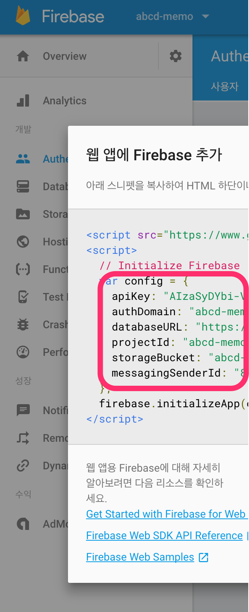

nuxt-vuetify-memo
=================

## 1. 기본 환경 설정 <2>
``` bash
$ node -v
$ npm -v #yarn -v
$ firebase --version #없으면 npm i -g firebase-tools
$ vue --version #없으면 npm i -g vue-cli
# vs code 와 vetur plugin
```
tip: npm-check가 설치되어 있으면 upgrade를 체크해줌.

## 2. 프로젝트 생성 (nuxt) <15>
### nuxtjs + vuetify project 만들기
vue-cli를 사용하여 [Nuxt.js](https://ko.nuxtjs.org) + [Vuetify.js](https://vuetifyjs.com/) 를 생성한다.
``` bash
$ vue init vuetifyjs/nuxt memo-project
$ cd memo-project
$ code .
# package.json에서 version을 latest로 변경한다.
$ npm install moment firebase --save # or yarn add moment firebase
$ npm install # or yarn
$ npm run dev # or yarn run dev
# 브라우져 접속 http://localhost:3000
```

### nuxt.config.js 수정
ESLINT 부분 제거

### hot deploy test
layouts/default.vue의 data.title을 '메모앱'으로 변경한다.

## 3. 순수 로컬에서 실행되는 앱 <50>

### default.vue 편집
1) 불필요한 영역 제거
불필요한 버튼 제거 : line 59 ~ 72, line 26 ~ 44 제거

2) 사용할 data format 정의
``` javascrit
	clipped: false,
	drawer: true,
	fixed: true,
	items: {
		aa: {
			id: 'aa',
			memo: 'Welcome',
			icon: 'label',
			datetime: '2017.09.14 00:00:00'
		},
		bb: {
			id: 'bb',
			memo: 'Inspire',
			icon: 'label',
			datetime: '2017.09.14 00:10:00'
		}
	},
	current:{},
	miniVariant: false,
	title: '메모앱'
```

3) data 노출 영역 변경
``` vi
> v-navigation-drawer에 permanent 추가. (drawer고정)
> v-list-title의 :to="time.to" 제거.
> v-list-tile-title의 title을 memo로 변경.
> 같은 레벨로 <v-list-tile-sub-title v-text="item.datetime"></v-list-tile-sub-title> 추가
```

4) 편집영역 추가
``` javascript
//<nuxt />
<v-layout row wrap>
	<v-flex d-flex xs12>
		<v-card>
			<v-text-field
				placeholder="새로운 메모를 입력해보세요!"
				full-width
				rows="15"
				v-model="current.memo"
				textarea
			></v-text-field>
		
			<v-card-text>
				<v-btn
					class="pink"
					dark
					absolute
					bottom
					right
					fab
				>
					<v-icon>add</v-icon>
				</v-btn>
			</v-card-text>
		</v-card>	
	</v-flex>
</v-layout>
```

5) 상세보기
``` javascript
//event 추가 (v-list-title)
@click.stop.prevent="detail(item)"
//detail method 생성
methods: {
	detail(i) {
		this.current = i
	}
}	
```
6) 새글쓰기
``` javascript
//event 추가 (pink btn에 추가)
@click="reset"
//reset method 생성
reset() {
	this.current = {memo:''};
}
```
7) 저장
``` javascript
//모듈 import
import Vue from 'vue'
import moment from 'moment'
//event 추가 (textarea)
@blur="save"
//save method 생성
save() {
	if(this.current.id || !this.current.memo) return;
	const id = moment().format('YYYYMMDDHHmmssSSS')
	Vue.set(this.items, id, {
		"icon":"label",
		"id":id,
		"memo":this.current.memo,
		"datetime": moment().format('YYYY.MM.DD HH:mm:ss')
	})
	this.reset()
	
}
```

8) 삭제
``` javascript
// button 추가 (v-list-tile-content 뒤)
<v-list-tile-action>
	<v-icon @click.stop.prevent="remove(item)">delete</v-icon>
</v-list-tile-action>
// remove method 추가
remove(i) {
	Vue.delete(this.items, i.id)
	this.reset()
}
```

## 4. firebase 실시간 DB 사용 <100>
### lib/firebase.js 생성
``` javascript
import Firebase from 'firebase'

const config = {};

var firebaseApp, db, auth, provider;
if(!firebaseApp && !Firebase.apps.length) {
	firebaseApp = Firebase.initializeApp(config);
}else {
	firebaseApp = Firebase.apps[0];
}

db		= firebaseApp.database();
auth	= firebaseApp.auth();
provider= new Firebase.auth.GoogleAuthProvider();

export default {firebaseApp, db, auth, provider}
```
firebase console에서 웹설정을 복사해서 config에 추가한다.


### 로그인/로그아웃 추가
1) data에 user추가
``` javascript
user: {}
```
2) 로그아웃 버튼 추가
``` javascript
//rightDrawer 버튼 영역을 대체한다.
<v-btn icon v-if="user.uid" @click="logout">
	<v-avatar>
		
	</v-avatar>
</v-btn>
```
3) 로그인 버튼 추가
``` javascript
//main 영역의 v-card아래에 추가
//원래 있는 v-card에는 v-if="user.uid" 추가
<v-card v-if="!user.uid">
	<v-btn large  @click="login">
		Login <v-icon>assignment_ind</v-icon>
	</v-btn>
</v-card>
```
4) 로그인/로그아웃 method추가
``` javascript
//import
import firebase from '../lib/firebase'
//method추가
login() {
	firebase.auth.signInWithPopup(firebase.provider)
},
logout() {
	this.user = {}
	firebase.auth.signOut();
},
```
5) 로그인 정보 수신 부분 추가
``` javascript
created() {
	const self = this;
	firebase.auth.onAuthStateChanged((u)=>{
		if(!u || !u.uid) return self.user = {};
		self.user = u;
	})
}
```
### firebase에서 data 가져오기
``` javascript
//기존 items의 sample data 제거
items: {},
//create hook에 data 조회 추가
const key = 'notes/' + self.user.uid
firebase.db.ref(key).off('value');
firebase.db.ref(key).orderByKey().on('value', (snapshot)=>{
	self.items = snapshot.val();
});
```
### firebase에서 저장하기
``` javascript
// save method 변경
save() {
	if(!this.current.memo) return
	
	let key = 'notes/' + this.user.uid;
	let data;
	if(!this.current.id) {
		const id = moment().format('YYYYMMDDHHmmssSSS')
		key += '/' + id
		data = {
			"icon":"label",
			"id":id,
			"memo":this.current.memo,
			"datetime": moment().format('YYYY.MM.DD HH:mm:ss')
		}
	}else {
		key += '/' + this.current.id
	}
	firebase.db.ref(key).set(data || this.current);
	this.reset()
}
```
### firebase에서 삭제하기 
``` javascript
// remove method 변경
remove(i) {
	let key = 'notes/' + this.user.uid + '/' + i.id
	firebase.db.ref(key).remove()
	this.reset()
}
```

## 5. firebase function 사용 <130>
### 설명
* event가 발생하면 특정 function을 실행한다.
* event에는 CloudEvent와 HttpsEvent로 구분된다.
* Analytics (event -> onLog)
	- user : event.data.user
* Authentication (user -> onCreate, onDelete) 
	- user : event.data
* Database (ref -> onWrite, onCreate, onUpdate, onDelete)
	- old data : event.data.previous (val())
	- new data : event.data (val())
* Pub/Sub : (topic -> onPublish)
	- message : event.data
* Storage (object -> onChange)
	- object : event.data
* HTTPS (https -> onRequest)
	- express 사용.
* 참조 : https://github.com/firebase/functions-samples
* 주의 :
	- realtime database의 무한 write 조심.
    - 무료에서는 외부 api 호출 불가.
	- HTTPS만 로컬에서 테스트 가능.
* 로그 보는 법 : firebase functions:log
``` javascript
const functions = require('firebase-functions');
exports.ok = functions.https.onRequest((req, res) => {
	res.status(200).send('OK');
});

exports.welcome = functions.auth.user().onCreate(event => {});
exports.bye = functions.auth.user().onDelete(event => {});
exports.helloPubSub = functions.pubsub.topic('topic-name').onPublish(event => {});

functions.storage.object().onChange ...
exports.makeUppercase = functions.database.ref('/messages/{pushId}/original').onWrite(event => {
      const original = event.data.val();
      console.log('Uppercasing', event.params.pushId, original);
      const uppercase = original.toUpperCase();
      return event.data.ref.parent.child('uppercase').set(uppercase);
});
```

### firebase 연결 (dist를 연결, function도 선택)
firebase project에서 function을 초기화한다.
``` bash
# firebase login은 실행했다고 가정
$ firebase init
~~~~~~~~
? Which Firebase CLI features do you want to setup for this folder? Press Space to select features, then Enter to confirm your choices.
 ◯ Database: Deploy Firebase Realtime Database Rules
 ◉ Functions: Configure and deploy Cloud Functions
❯◉ Hosting: Configure and deploy Firebase Hosting sites
~~~~~~~~
? Select a default Firebase project for this directory:
  [don't setup a default project]
  friendlychat (friendlychat-bccd2)
  siva6 (project-2879258099590994204)
❯ abcd-memo (abcd-memo-3a2f9)
  [create a new project]
~~~~~~~~
=== Functions Setup

A functions directory will be created in your project with a Node.js
package pre-configured. Functions can be deployed with firebase deploy.

✔  Wrote functions/package.json
✔  Wrote functions/index.js
? Do you want to install dependencies with npm now? (Y/n) Y
~~~~~~~~
=== Hosting Setup

Your public directory is the folder (relative to your project directory) that
will contain Hosting assets to be uploaded with firebase deploy. If you
have a build process for your assets, use your build's output directory.

? What do you want to use as your public directory? (public) dist
? Configure as a single-page app (rewrite all urls to /index.html)? (y/N) N
```
functions 의 helloworld 작업
- 생성된 functions의 index.js를 열어 코드의 주석을 해제한다.

firebase에 deloy
``` bash

# hosting 및 functions 배포
$ firebase deploy
~~~~~~~~
✔  Deploy complete!

Project Console: https://console.firebase.google.com/project/abcd-memo-3a2f9/overview
Hosting URL: https://abcd-memo-3a2f9.firebaseapp.com
Function URL (helloWorld): https://us-central1-abcd-memo-3a2f9.cloudfunctions.net/helloWorld
```
functions/index.js 수정
``` javascript
const functions = require('firebase-functions')
const admin 	= require('firebase-admin')

admin.initializeApp(functions.config().firebase);

exports.select = functions.https.onRequest((req, res) => {
	if (req.method !== 'GET') {
		res.status(403).send('Forbidden!');
		return;
	}

	const key = 'notes/'
	admin.database().ref(key).once('value', (snapshot)=>{
		console.log('value:', snapshot.val());
		res.status(200).send(JSON.stringify(snapshot.val()));
	});
});
// 생성된 url 호출
// log 확인
```

Google Sheet 사용하기
- google 개발 console로 이동 [https://console.developers.google.com](https://console.developers.google.com)
- 프로젝트 선택
- 라이브러리로 이동하여 Google Sheets API를 검색하여 사용 설정.

- 사용자 인증 정보 > OAuth 2.0 클라이언트 ID 선택 후 'https://developers.google.com/oauthplayground/' 추가 & 'JSON다운로드' 실행


- 다운 받은 json 파일을 functions 디렉토리에 auth_key.json으로 저장한다.
- [https://developers.google.com/oauthplayground/](https://developers.google.com/oauthplayground/)오픈


- 결과 json을 auth_key.json에 추가한다.
- functions 아래에서 필요한 모듈을 추가한다.
``` bash
$ cd functions
$ npm install googleapis --save #yarn add googleapis
```
- functions/sheets.js를 생성한다.
``` javascript
const fs = require('fs')
const google = require('googleapis')
const config = require('./auth_key.json');
const OAuth2 = google.auth.OAuth2;
const oauth2Client = new OAuth2(
	config.web.client_id,
	config.web.client_secret,
	config.web.redirect_uris[1]
);

oauth2Client.setCredentials({
	access_token: config.web.access_token,
	refresh_token: config.web.refresh_token
});

const sheets = google.sheets('v4')
function insertLog(type, uid, id, memo) {
	sheets.spreadsheets.values.append({
		auth: oauth2Client,
		spreadsheetId: 문서명,
		valueInputOption: 'USER_ENTERED',
		range: 시트명,
		resource: {
			values: [
				[new Date(), type, uid, id, memo]
			]
		}
		}, function(err, response) {
			console.log(err, response)
		}
	);
}

exports.insertLog = insertLog
//로컬 테스트를 해본다.
```
functions/index.js 수정
``` javascript
const functions = require('firebase-functions')
const admin 	= require('firebase-admin')
const sheets	= require('./sheets')

admin.initializeApp(functions.config().firebase);

function memoHandler(e) {
	let msg = e.data.val();
	if(!msg) {
		msg = {
			id:e.params.key,
			memo:''
		}
	}
	console.log('event', e, msg);
	sheets.insertLog(e.eventType, e.params.uid, msg.id, msg.memo);
}

exports.select = functions.https.onRequest((req, res) => {
	if (req.method !== 'GET') {
		res.status(403).send('Forbidden!');
		return;
	}

	const key = 'notes/'
	admin.database().ref(key).once('value', (snapshot)=>{
		console.log('value:', snapshot.val());
		res.status(200).send(JSON.stringify(snapshot.val()));
	});
});

exports.createMemo = functions.database.ref('/notes/{uid}/{key}').onCreate(memoHandler);
exports.updateMemo = functions.database.ref('/notes/{uid}/{key}').onUpdate(memoHandler);
exports.deleteMemo = functions.database.ref('/notes/{uid}/{key}').onDelete(memoHandler);
```
functions만 배포
``` bash
$ firebase deploy --only functions
```
전체 배포
``` bash
$ npm run generate # yarn generate
$ firebase deploy
```