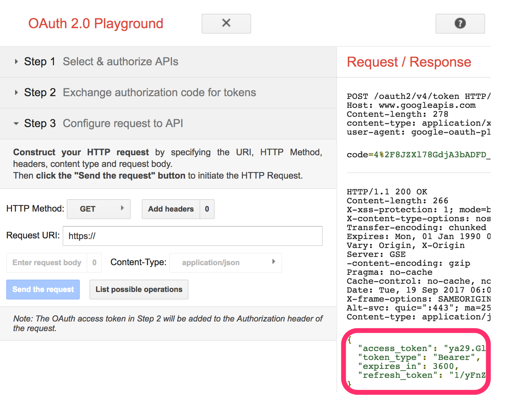

nuxt-vuetify-memo
=================
> 스터디 : JS기초 -> ES6 -> VueJS -> **Firebase** -> ...

> 아래와 같은 app을 만드는 codelab

# 1. 기본 환경 설정 <2>
> NodeJS (필수)
``` bash
$ node -v
$ npm -v 
```
- macOS : brew install node 추천
- linux : https://github.com/creationix/nvm 추천 (nvm install 8.5.0)
- windows : https://github.com/coreybutler/nvm-windows/releases latest release의 nvm-setup.zip 추천 (nvm install 8.5.0 -> nvm use 8.5.0)

> Firebase Tools (필수)
``` bash
$ firebase --version 
# 없으면 npm i -g firebase-tools
```

> Vue cli (필수)
``` bash
$ vue --version 
# 없으면 npm i -g vue-cli
```

> yarn (옵션)
``` bash
$ yarn -v 
# 없으면 npm i -g yarn
```

> Visual Studio Code (옵션)
- download : [https://code.visualstudio.com/Download](https://code.visualstudio.com/Download)
- macOS : brew cask install visual-studio-code
- 추가 plugin vetur 설치

>tip: npm-check가 설치되어 있으면 upgrade를 체크해줌.
``` bash
$ npm-check -gu 
# 없으면 npm i -g npm-check
```

# 2. 프로젝트 생성 (nuxt) <15>
## > nuxtjs + vuetify project 만들기
> vue-cli를 사용하여 [Nuxt.js](https://ko.nuxtjs.org) + [Vuetify.js](https://vuetifyjs.com/) 를 생성한다.
(이 예제에서는 route, store등의 기능을 사용하지 않는다.)

> 아래 명령어를 실행하여 프로젝트 생성 및 기본 화면을 확인한다.
``` bash
$ vue init vuetifyjs/nuxt memo-project
# project name, project description, Author는 자유롭게 입력. 
$ cd memo-project
$ npm install moment firebase --save # or yarn add moment firebase
$ npm install # or yarn
$ npm run dev # or yarn run dev
# 만약 install과정에 오류가 발생하면, package.json에서 version을 latest로 변경해보고 다시 실행해본다.
# 브라우져 접속 경로 : http://localhost:3000
```


## > nuxt.config.js 수정
> 작성자 코딩스타일과 맞지 않아 기본 ESLINT 부분을 제거합니다. 
> (제거 없이 규칙을 수정하거나, 규약에 맞춰 개발할 수도 있습니다.)
``` javascript
if (ctx.dev && ctx.isClient) {
//	config.module.rules.push({
//   	enforce: 'pre',
//        test: /\.(js|vue)$/,
//        loader: 'eslint-loader',
//        exclude: /(node_modules)/
//    })
}
```

# 3. 순수 로컬에서 실행되는 앱 <50>
## layouts/default.vue 편집 (이 파일 하나에서 모든 동작이 수행됩니다.)
> 1) 불필요한 영역 제거
``` xml
<!-- 59라인에서 72라인까지의 아래 소스를 제거한다. (오늘쪽 메뉴 영역) -->
<v-navigation-drawer
	temporary
	:right="right"
	v-model="rightDrawer"
>
	<v-list>
		<v-list-tile @click="right = !right">
			<v-list-tile-action>
			<v-icon light>compare_arrows</v-icon>
			</v-list-tile-action>
			<v-list-tile-title>Switch drawer (click me)</v-list-tile-title>
		</v-list-tile>
	</v-list>
</v-navigation-drawer>
<!-- 26라인에서 44라인까지의 아래 소스를 제거한다. (메뉴 상단의 아이콘과 버튼) -->
<v-toolbar-side-icon @click.stop="drawer = !drawer"></v-toolbar-side-icon>
<v-btn
	icon
	@click.stop="miniVariant = !miniVariant"
>
	<v-icon v-html="miniVariant ? 'chevron_right' : 'chevron_left'"></v-icon>
</v-btn>
<v-btn
	icon
	@click.stop="clipped = !clipped"
>
	<v-icon>web</v-icon>
</v-btn>
<v-btn
	icon
	@click.stop="fixed = !fixed"
>
	<v-icon>remove</v-icon>
</v-btn>
```

> 2) 사용할 data format 정의
``` javascript
// 배열 data 형식을 firebase realtime database처럼 object형태로 변경합니다.
// 현제 선택된 item을 표현할 current를 추가합니다.
export default {
	data() {
		return {
			clipped: false,
			drawer: true,
			fixed: true,
			items: {
				aa: {id: 'aa',	memo: 'Welcome',icon: 'label', datetime: '2017.09.14 00:00:00'},
				bb: {id: 'bb', memo: 'Inspire',	icon: 'label', datetime: '2017.09.14 00:10:00'}
			},
			current:{memo:''},
			miniVariant: false,
			title: '메모앱'
		}
	}
}
```

> 3) 왼쪽 data 목록 영역을 바뀐 items에 맞게 변경.
``` html
<!--
v-navigation-drawer 에 permanent 속성 추가.
v-list-tile에서 :to="item.to" 제거.
v-icon에 v-bind:class="{'orange--text':item.id==current.id}" 을 추가해서 선택시 icon생상을 변경한다.
v-list-tile-title의 item.title을 item.memo로 변경.
v-list-tile-title 밑에 <v-list-tile-sub-title v-text="item.datetime"></v-list-tile-sub-title> 추가
-->
<v-navigation-drawer permanent persistent :mini-variant="miniVariant" :clipped="clipped" v-model="drawer" enable-resize-watcher>
	<v-list>
		<v-list-tile v-for="(item, i) in items" :key="i">
			<v-list-tile-action>
				<v-icon v-bind:class="{'orange--text':item.id==current.id}" v-html="item.icon"></v-icon>
			</v-list-tile-action>
			<v-list-tile-content>
				<v-list-tile-title v-text="item.memo"></v-list-tile-title>
				<v-list-tile-sub-title v-text="item.datetime"></v-list-tile-sub-title>
			</v-list-tile-content>
		</v-list-tile>
	</v-list>
</v-navigation-drawer>
```

> 4) 편집영역 추가
``` html
<!--
<nuxt />를 제거하고 아래 소스를 추가한다.
-->
<v-layout row wrap>
	<v-flex d-flex xs12>
		<v-card>
			<v-text-field placeholder="새로운 메모를 입력해보세요!" full-width rows="15" v-model="current.memo" textarea></v-text-field>

			<v-card-text>
				<v-btn class="pink" dark absolute bottom right fab>
					<v-icon>add</v-icon>
				</v-btn>
			</v-card-text>
		</v-card>
	</v-flex>
</v-layout>
```


> 5) 상세 보기 기능 작업

- 왼쪽 영역 클릭시 가운데 편집창에 반영되는 기능을 추가한다. (vue의 bind로 수정도 적용됩니다.)
``` html
<!-- v-list-title event 추가 -->
<v-list-tile v-for="(item, i) in items" :key="i" @click.stop.prevent="detail(item)">
```
``` javascript
//detail method 생성
export default {
	data() {
		~~~생략~~~
	},
	methods: {
		detail(i) {
			this.current = i
		}
	}	
}
```

> 6) 새글 기능 작업
- 편집창안에 글을 지우고 새글을 받을 준비를 합니다.
``` html
<!-- textare 편집창 아래의 pink btn에  event 추가 -->
<v-btn class="pink" dark absolute bottom right fab @click="reset">
```
``` javascript
//methods안에 reset method 추가
reset() {
	this.current = {memo:''};
}
```

> 7) 저장 기능 작업
- 편집창에서 focus를 잃으면 items에 저장
``` html
<!-- textarea에 event 추가 -->
<v-text-field @blur="save" placeholder="새로운 메모를 입력해보세요!" full-width rows="15" v-model="current.memo" textarea></v-text-field>
```
``` javascript
//모듈 import
<script>
import Vue from 'vue'
import moment from 'moment'

export default {
	~~~생략~~~
```
``` javascript
//methods안에 save method 추가
save() {
	//id가 있으면 수정이기 때문에 무시
	if(this.current.id || !this.current.memo) return;
	const id = moment().format('YYYYMMDDHHmmssSSS')
	Vue.set(this.items, id, {
		"icon":"label",
		"id":id,
		"memo":this.current.memo,
		"datetime": moment().format('YYYY.MM.DD HH:mm:ss')
	})
	this.reset()
}
```

> 8) 삭제 기능 작업
``` html
<!-- v-list-tile-content 아래에 삭제 버튼을 추가한다. -->
<v-list-tile-action>
	<v-icon @click.stop.prevent="remove(item)">delete</v-icon>
</v-list-tile-action>
```
``` javascript
//methods안에 remove method 추가
remove(i) {
	Vue.delete(this.items, i.id)
	this.reset()
}
```


# 4. firebase 실시간 DB 사용으로 변경 <100>
## firebase project 생성
> [console.firebase.google.com](https://console.firebase.google.com/u/0/)로 접속해서 프로젝트를 생성합니다.
> Authentication에 들어가서 google login을 활성화 합니다. (이 예제에서는 google login만 사용합니다.)


## lib/firebase.js 작업
> firebase와 연동하기 위한 기본 object들을 정의하는 모듈입니다.
> lib폴더를 생성하고 그 아래 firebase.js를 아래처럼 생성한다.
``` javascript
import Firebase from 'firebase'

const config = {};

var firebaseApp, db, auth, provider;
if(!firebaseApp && !Firebase.apps.length) {
	firebaseApp = Firebase.initializeApp(config);
}else {
	firebaseApp = Firebase.apps[0];
}

db	= firebaseApp.database();
auth	= firebaseApp.auth();
provider= new Firebase.auth.GoogleAuthProvider();

export default {firebaseApp, db, auth, provider}
```
- firebase console의 Authentication 메뉴에서 웹설정을 클릭해서 나온 화면에서 config값만 복사한다.
- lib/firebase.js의 config에 추가한다.


## 로그인/로그아웃 추가
> 1) layouts/default.vue 소스에서 data에 user추가하고 items을 비워줍니다.
``` javascript
data() {
	return {
		clipped: false,
		drawer: true,
		fixed: true,
		items: {},
		current: { memo: '' },
		user: {},
		miniVariant: false,
		title: '메모앱'
	}
}
```

> 2) 로그아웃용 avatar영역 추가
``` xml
<!-- 아래의 rightDrawer 영역을 -->
<v-btn icon @click.stop="rightDrawer = !rightDrawer">
	<v-icon>menu</v-icon>
</v-btn>
<!-- 아래의 avatar btn으로 대체한다. -->
<v-btn icon v-if="user.uid" @click="logout">
	<v-avatar>
		
	</v-avatar>
</v-btn>
```

> 3) 로그인 버튼 추가
- 로그인 여부에 따라 편집창/로그인버튼으로 표시한다.
``` xml
<!-- 편집창 영역 변경 -->
<v-card v-if="user.uid">
	<v-text-field @blur="save" placeholder="새로운 메모를 입력해보세요!" full-width rows="15" v-model="current.memo" textarea></v-text-field>

	<v-card-text>
		<v-btn class="pink" dark absolute bottom right fab @click="reset">
			<v-icon>add</v-icon>
		</v-btn>
	</v-card-text>
</v-card>
<v-card v-if="!user.uid">
	<v-btn large @click="login">
		Login
		<v-icon>assignment_ind</v-icon>
	</v-btn>
</v-card>
```

> 4) 로그인/로그아웃 method추가
``` javascript
// 기존 import한 영역에 추가한다.
import firebase from '../lib/firebase'
```
``` javascript
//methods에 두개의 method를 추가한다.
login() {
	firebase.auth.signInWithPopup(firebase.provider)
},
logout() {
	this.user = {}
	firebase.auth.signOut();
},
```

> 5) 로그인 정보 수신 부분 추가
- 사용자 로그인 상태가 변경되는 경우 수신한다.
``` javascript
methods() {
	~~생략~~
},
created() {
	const self = this;
	firebase.auth.onAuthStateChanged((u)=>{
		if(!u || !u.uid) return self.user = {};
		self.user = u;
	})
}
```

## firebase에서 data 가져오기
``` javascript
//created hook에 data 조회 부분을 추가한다.
created() {
	const self = this;
	firebase.auth.onAuthStateChanged((u) => {
		if (!u || !u.uid) return self.user = {};
		self.user = u;

		const key = 'notes/' + self.user.uid
		firebase.db.ref(key).off('value');
		firebase.db.ref(key).orderByKey().on('value', (snapshot) => {
			self.items = snapshot.val();
		});
	})
}
```

## firebase에서 저장하기
``` javascript
// 기존 save() method를 firebase를 사용하도록 변경한다.
save() {
	if(!this.current.memo) return
	
	let key = 'notes/' + this.user.uid;
	let data;
	if(!this.current.id) {
		const id = moment().format('YYYYMMDDHHmmssSSS')
		key += '/' + id
		data = {
			"icon":"label",
			"id":id,
			"memo":this.current.memo,
			"datetime": moment().format('YYYY.MM.DD HH:mm:ss')
		}
	}else {
		key += '/' + this.current.id
	}
	firebase.db.ref(key).set(data || this.current);
	this.reset()
}
```

## firebase에서 삭제하기 
``` javascript
// 기존 remove() method를 firebase에서 삭제하도록 변경한다.
remove(i) {
	firebase.db.ref('notes/' + this.user.uid + '/' + i.id).remove()
	this.reset()
}
```

# 5. firebase function 사용 <130>
## 설명
* event가 발생하면 특정 function을 실행한다.
* event에는 CloudEvent와 HttpsEvent로 구분된다.
* Analytics (event -> onLog)
	- user : event.data.user
* Authentication (user -> onCreate, onDelete) 
	- user : event.data
* Database (ref -> onWrite, onCreate, onUpdate, onDelete)
	- old data : event.data.previous (val())
	- new data : event.data (val())
* Pub/Sub : (topic -> onPublish)
	- message : event.data
* Storage (object -> onChange)
	- object : event.data
* HTTPS (https -> onRequest)
	- express 사용.
* 참조 : https://github.com/firebase/functions-samples
* 주의 :
	- realtime database의 무한 write 조심.
    - 무료에서는 외부 api 호출 불가.
	- HTTPS만 로컬에서 테스트 가능.
* 로그 보는 법 : firebase functions:log
``` javascript
const functions = require('firebase-functions');
exports.ok = functions.https.onRequest((req, res) => {
	res.status(200).send('OK');
});

exports.welcome = functions.auth.user().onCreate(event => {});
exports.bye = functions.auth.user().onDelete(event => {});
exports.helloPubSub = functions.pubsub.topic('topic-name').onPublish(event => {});

functions.storage.object().onChange ...
exports.makeUppercase = functions.database.ref('/messages/{pushId}/original').onWrite(event => {
      const original = event.data.val();
      console.log('Uppercasing', event.params.pushId, original);
      const uppercase = original.toUpperCase();
      return event.data.ref.parent.child('uppercase').set(uppercase);
});
```

## firebase 연결 (dist를 연결, function도 선택)
> firebase project에서 function을 초기화한다.
``` bash
# firebase login은 실행했다고 가정 안했다면 firebase login실행.
$ firebase init
~~~~~~~~
? Which Firebase CLI features do you want to setup for this folder? Press Space to select features, then Enter to confirm your choices.
 ◯ Database: Deploy Firebase Realtime Database Rules
 ◉ Functions: Configure and deploy Cloud Functions
❯◉ Hosting: Configure and deploy Firebase Hosting sites
~~~~~~~~
? Select a default Firebase project for this directory:
  [don't setup a default project]
  friendlychat (friendlychat-bccd2)
  siva6 (project-2879258099590994204)
❯ abcd-memo (abcd-memo-3a2f9)
  [create a new project]
~~~~~~~~
=== Functions Setup

A functions directory will be created in your project with a Node.js
package pre-configured. Functions can be deployed with firebase deploy.

✔  Wrote functions/package.json
✔  Wrote functions/index.js
? Do you want to install dependencies with npm now? (Y/n) Y
~~~~~~~~
=== Hosting Setup

Your public directory is the folder (relative to your project directory) that
will contain Hosting assets to be uploaded with firebase deploy. If you
have a build process for your assets, use your build's output directory.

? What do you want to use as your public directory? (public) dist
? Configure as a single-page app (rewrite all urls to /index.html)? (y/N) N
```

>functions 의 helloworld 작업
- 생성된 functions의 index.js를 열어 코드의 주석을 해제한다.

>firebase에 deloy
``` bash
# hosting 및 functions 배포
$ firebase deploy
~~~~~~~~
✔  Deploy complete!

Project Console: https://console.firebase.google.com/project/abcd-memo-3a2f9/overview
Hosting URL: https://abcd-memo-3a2f9.firebaseapp.com
Function URL (helloWorld): https://us-central1-abcd-memo-3a2f9.cloudfunctions.net/helloWorld
```

> functions/index.js 수정
``` javascript
const functions = require('firebase-functions')
const admin 	= require('firebase-admin')

admin.initializeApp(functions.config().firebase);

exports.select = functions.https.onRequest((req, res) => {
	if (req.method !== 'GET') {
		res.status(403).send('Forbidden!');
		return;
	}

	const key = 'notes/'
	admin.database().ref(key).once('value', (snapshot)=>{
		console.log('value:', snapshot.val());
		res.status(200).send(JSON.stringify(snapshot.val()));
	});
});
// 생성된 url 호출
// log 확인
```

> Google Sheet 사용하기
- google 개발 console로 이동 [https://console.developers.google.com](https://console.developers.google.com)
- 프로젝트 선택
- 라이브러리로 이동하여 Google Sheets API를 검색하여 사용 설정.

- 사용자 인증 정보 > OAuth 2.0 클라이언트 ID 선택 후 'https://developers.google.com/oauthplayground' 추가 & 'JSON다운로드' 실행


- 다운 받은 json 파일을 functions 디렉토리에 auth_key.json으로 저장한다.
- [https://developers.google.com/oauthplayground](https://developers.google.com/oauthplayground)오픈



- 결과 json을 auth_key.json에 추가한다.
- functions 아래에서 필요한 모듈을 추가한다.
``` bash
$ cd functions
$ npm install googleapis --save #yarn add googleapis
```
- functions/sheets.js를 생성한다.
``` javascript
const fs = require('fs')
const google = require('googleapis')
const config = require('./auth_key.json');
const OAuth2 = google.auth.OAuth2;
const oauth2Client = new OAuth2(
	config.web.client_id,
	config.web.client_secret,
	config.web.redirect_uris[1]
);

oauth2Client.setCredentials({
	access_token: config.web.access_token,
	refresh_token: config.web.refresh_token
});

const sheets = google.sheets('v4')
function insertLog(type, uid, id, memo) {
	sheets.spreadsheets.values.append({
		auth: oauth2Client,
		spreadsheetId: 문서명,
		valueInputOption: 'USER_ENTERED',
		range: 시트명,
		resource: {
			values: [
				[new Date(), type, uid, id, memo]
			]
		}
		}, function(err, response) {
			console.log(err, response)
		}
	);
}

exports.insertLog = insertLog
//로컬 테스트를 해본다.
```
functions/index.js 수정
``` javascript
const functions = require('firebase-functions')
const admin 	= require('firebase-admin')
const sheets	= require('./sheets')

admin.initializeApp(functions.config().firebase);

function memoHandler(e) {
	let msg = e.data.val();
	if(!msg) {
		msg = {
			id:e.params.key,
			memo:''
		}
	}
	console.log('event', e, msg);
	sheets.insertLog(e.eventType, e.params.uid, msg.id, msg.memo);
}

exports.select = functions.https.onRequest((req, res) => {
	if (req.method !== 'GET') {
		res.status(403).send('Forbidden!');
		return;
	}

	const key = 'notes/'
	admin.database().ref(key).once('value', (snapshot)=>{
		console.log('value:', snapshot.val());
		res.status(200).send(JSON.stringify(snapshot.val()));
	});
});

exports.createMemo = functions.database.ref('/notes/{uid}/{key}').onCreate(memoHandler);
exports.updateMemo = functions.database.ref('/notes/{uid}/{key}').onUpdate(memoHandler);
exports.deleteMemo = functions.database.ref('/notes/{uid}/{key}').onDelete(memoHandler);
```

> functions만 배포
``` bash
$ firebase deploy --only functions
```

> 전체 배포
``` bash
$ npm run generate # yarn generate
$ firebase deploy
```